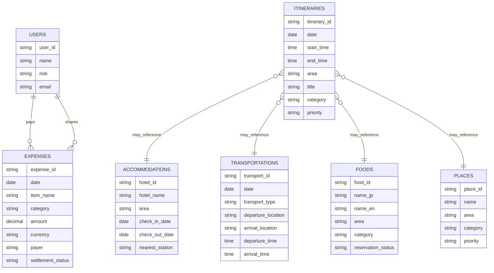

# 日本東京行旅遊管理系統｜系統規格文件

> 版本：v1.0  
> 建立日期：2026-05-28  
> 旅遊期間：2026/06/22（一）～2026/06/28（日）  
> 適用行程：日本東京行、富士山／河口湖一日行  
> 需求來源：使用者提供之行程規劃文件與後續補充說明  

---

## 1. 專案背景

本系統為多人日本東京旅遊所設計的旅遊管理系統，目的在於將原本分散於文件、表格、截圖與聊天紀錄中的旅遊資訊整合成一個可查詢、可更新、可記錄支出的管理平台。

本次旅遊原訂為 2026/06/22～2026/06/27，但因回程航班異動至 2026/06/28，因此旅遊期間調整為 2026/06/22～2026/06/28。  
6/27 需更換一次住宿，於三之輪站附近住宿一晚，隔日 6/28 前往成田機場返台。

---

## 2. 系統目標

### 2.1 核心目標

1. 整合每日行程、住宿、交通、餐廳、景點商店與支出紀錄。
2. 讓同行者能快速查看每天要去哪裡、幾點集合、搭什麼交通工具。
3. 管理已訂位餐廳、已購交通票券、住宿資訊與重要提醒。
4. 支援旅途中即時記帳，方便多人分帳與統計每人應付金額。
5. 提供行程備案欄位，避免遇到天氣、交通或排隊狀況時無法調整。

---

## 3. 使用者角色

| 角色 | 權限說明 |
|---|---|
| 行程管理者 | 可新增、修改、刪除所有行程、住宿、交通、餐廳、景點與支出資料 |
| 同行旅伴 | 可查看所有資料，可新增支出紀錄，可查看分帳結果 |
| 記帳負責人 | 可管理支出、付款者、分攤人、結清狀態 |
| 一般查看者 | 僅能查看行程與基本資訊，不可修改資料 |

---

## 4. 系統模組總覽

本系統分為以下 7 個主要模組：

| 模組 | 功能目的 |
|---|---|
| 總覽 Dashboard | 顯示旅遊核心資訊、今日行程、重要提醒 |
| 行程表 | 管理每日時間軸、地點、活動與備案 |
| 住宿 | 管理不同日期的住宿、地址、Check in / Check out |
| 交通 | 管理航班、Skyliner、JR、地鐵、包車與移動路線 |
| 吃與喝 | 管理餐廳、咖啡廳、已訂位資訊與備選店家 |
| 景點與商店 | 管理景點、商店、購物點、拍照點與優先度 |
| 支出記錄 | 管理共同支出、個人支出、付款者、分帳與結清狀態 |

---

## 5. 功能需求

---

# 5.1 總覽 Dashboard 模組

## 5.1.1 功能說明

總覽頁為系統首頁，提供旅途中最常查看的資訊。

## 5.1.2 顯示內容

| 欄位 | 內容 |
|---|---|
| 旅遊名稱 | 日本東京行 |
| 旅遊日期 | 2026/06/22（一）～2026/06/28（日） |
| 主要城市 | 東京、上野、澀谷、新宿、池袋、淺草、秋葉原、河口湖、富士山 |
| 去程航班 | 台北 TPE → 成田 NRT，02:20～06:50 |
| 回程航班 | 成田 NRT → 台北 TPE，17:40～20:20 |
| 回程提醒 | 6/28 14:50 前需抵達成田機場 |
| 主要住宿 1 | 田端站附近，6/22～6/27 |
| 主要住宿 2 | 三之輪站附近，6/27～6/28 |
| 重要交通 | Skyliner、JR 山手線、富士急行線、包車 |
| 重要訂位 | Yoroniku、THE SUSHI TOKYO 旬 |

## 5.1.3 今日行程卡片

系統應能依照日期顯示當日行程摘要。

| 欄位 | 說明 |
|---|---|
| 日期 | 自動帶入當日日期 |
| 今日區域 | 例如：澀谷、表參道、上野、淺草 |
| 今日重點 | 顯示主要行程 |
| 已訂位項目 | 顯示餐廳或門票訂位 |
| 交通提醒 | 顯示當日重要交通時間 |
| 支出提醒 | 顯示尚未結清支出 |

---

# 5.2 行程表模組

## 5.2.1 功能說明

管理每日旅遊行程，支援時間、地點、活動、交通、備註與備案。

## 5.2.2 欄位設計

| 欄位名稱 | 欄位型態 | 必填 | 說明 |
|---|---|---|---|
| itinerary_id | 文字 / UUID | 是 | 行程唯一編號 |
| date | 日期 | 是 | 行程日期 |
| day_label | 文字 | 否 | Day 1、Day 2 等 |
| start_time | 時間 | 否 | 開始時間 |
| end_time | 時間 | 否 | 結束時間 |
| area | 文字 | 是 | 區域，例如澀谷、上野 |
| title | 文字 | 是 | 行程名稱 |
| category | 選單 | 是 | 景點、餐廳、交通、購物、住宿、自由活動 |
| location_name | 文字 | 否 | 地點名稱 |
| address | 文字 | 否 | 地址 |
| google_map_url | URL | 否 | Google Maps 連結 |
| transport_note | 文字 | 否 | 交通方式 |
| reservation_status | 選單 | 否 | 無需預約、待預約、已預約 |
| priority | 選單 | 否 | 高、中、低 |
| backup_plan | 文字 | 否 | 備案 |
| note | 文字 | 否 | 備註 |

## 5.2.3 已整理行程資料

| 日期 | 區域 | 時間 | 行程內容 | 備註 |
|---|---|---|---|---|
| 6/22 | 成田 / 上野 | 02:20-06:50 | 台北飛成田 | 去程航班 |
| 6/22 | 上野 | 08:22-09:15 | Skyliner 成田機場 T1 → 上野 | 抵達後寄放行李 |
| 6/22 | 秋葉原 | 下午 | 海洋堂、無線電會館、BicCamera | 模型、電器、動漫相關 |
| 6/22 | 田端 | 16:00 | 田端住宿 Check in | 主要住宿 |
| 6/23 | 澀谷 / 表參道 | 白天 | AURALEE、PARCO、THE JOJO WORLD、Stüssy Shibuya、10010 南青山、A.PRESSE、Graphpaper、Style Department | 逛街日 |
| 6/23 | 澀谷 | 晚上 | Shibuya Sky | 6/1 訂票 |
| 6/23 | 表參道 | 20:30 | Yoroniku 燒肉 | 已訂位，5 人 |
| 6/24 | 河口湖 / 富士山 | 08:00 | 包車前往富士山周邊 | 富士山一日行 |
| 6/24 | 河口湖 | 白天 | Lawson、河口湖遊船、富士山站、北口本宮富士淺間神社 | 河口湖遊船 9:00 起，每 30 分鐘一班 |
| 6/25 | 池袋 | 12:00 | THE SUSHI TOKYO 旬 | 已訂位，5 人 |
| 6/25 | 新宿 / 東京站 | 下午 | 新宿、東京車站、東京車站地下街 | 彈性安排 |
| 6/26 | 新宿 / 東京鐵塔 | 彈性 | 鶏繁、東京鐵塔 | 可作為彈性日 |
| 6/27 | 上野 / 淺草 | 白天 | 東京國立博物館、淺草寺 | 退房後先到上野寄放行李 |
| 6/27 | 三之輪 | 16:00 | 更換飯店 Check in | 住一晚，隔日返台 |
| 6/28 | 上野 / 成田 | 13:40-14:24 | Skyliner 上野 → 成田機場 T1 | 14:50 前需到機場 |
| 6/28 | 成田 / 台北 | 17:40-20:20 | 成田飛台北 | 回程航班 |

---

# 5.3 住宿模組

## 5.3.1 功能說明

管理本次旅遊不同階段的住宿資訊。因航班異動，住宿分為兩段：

1. 6/22～6/27：田端住宿
2. 6/27～6/28：三之輪住宿

## 5.3.2 欄位設計

| 欄位名稱 | 欄位型態 | 必填 | 說明 |
|---|---|---|---|
| hotel_id | 文字 / UUID | 是 | 住宿唯一編號 |
| hotel_name | 文字 | 是 | 飯店或民宿名稱 |
| area | 文字 | 是 | 地區 |
| nearest_station | 文字 | 否 | 最近車站 |
| check_in_date | 日期 | 是 | 入住日期 |
| check_out_date | 日期 | 是 | 退房日期 |
| check_in_time | 時間 | 否 | 入住時間 |
| check_out_time | 時間 | 否 | 退房時間 |
| address | 文字 | 否 | 地址 |
| booking_platform | 文字 | 否 | 訂房平台 |
| booking_number | 文字 | 否 | 訂單編號 |
| payer | 文字 | 否 | 付款者 |
| total_amount | 數字 | 否 | 總金額 |
| per_person_amount | 數字 | 否 | 每人金額 |
| luggage_note | 文字 | 否 | 行李寄放資訊 |
| note | 文字 | 否 | 備註 |

## 5.3.3 住宿資料

| 住宿編號 | 日期 | 地區 | 地址 / 位置 | 最近車站 | 備註 |
|---|---|---|---|---|---|
| H001 | 6/22～6/27 | 田端 | 東京都北區田端 1-20-6 | JR 田端站，步行約 4 分鐘 | 主要住宿 |
| H002 | 6/27～6/28 | 三之輪 | 待補 | 三之輪站 | 最後一晚住宿，隔日返台 |

## 5.3.4 田端住宿周邊便利商店

| 名稱 | 類型 | 距離 / 備註 |
|---|---|---|
| 成城石井 アトレヴィ田端店 | 超市 | JR 田端站內 |
| FamilyMart 田端駅前店 | 便利商店 | 民宿步行約 6 分鐘，JR 田端站步行約 2 分鐘 |
| Lawson 田端与楽寺前店 | 便利商店 | 民宿步行約 3 分鐘 |

---

# 5.4 交通模組

## 5.4.1 功能說明

管理航班、機場交通、市區交通、富士山交通與包車資訊。

## 5.4.2 欄位設計

| 欄位名稱 | 欄位型態 | 必填 | 說明 |
|---|---|---|---|
| transport_id | 文字 / UUID | 是 | 交通紀錄編號 |
| date | 日期 | 是 | 搭乘日期 |
| transport_type | 選單 | 是 | 飛機、Skyliner、JR、地鐵、包車、步行 |
| departure_location | 文字 | 是 | 出發地 |
| arrival_location | 文字 | 是 | 抵達地 |
| departure_time | 時間 | 否 | 出發時間 |
| arrival_time | 時間 | 否 | 抵達時間 |
| route | 文字 | 否 | 路線說明 |
| ticket_status | 選單 | 否 | 未購買、已購買、現場購買 |
| cost | 數字 | 否 | 交通費用 |
| payer | 文字 | 否 | 付款者 |
| note | 文字 | 否 | 備註 |

## 5.4.3 交通資料

| 日期 | 交通方式 | 起點 | 終點 | 時間 | 備註 |
|---|---|---|---|---|---|
| 6/22 | 飛機 | 台北 TPE | 成田 NRT | 02:20-06:50 | 去程 |
| 6/22 | Skyliner | 成田機場 T1 | 上野 | 08:22-09:15 | 已規劃 |
| 6/24 | JR / 特急 | 田端 | 大月 | 約 1 小時 30 分 | 建議 07:00 出門 |
| 6/24 | 富士急行線 | 大月 | 富士山 / 河口湖 | 08:50 或 09:16 | 前往富士山周邊 |
| 6/24 | 包車 | 富士山 / 河口湖周邊 | 各景點 | 08:00 起 | 富士山一日行 |
| 6/28 | Skyliner | 上野 | 成田機場 T1 | 13:40-14:24 或 13:00-13:44 | 14:50 前到機場 |
| 6/28 | 飛機 | 成田 NRT | 台北 TPE | 17:40-20:20 | 回程 |

---

# 5.5 吃與喝模組

## 5.5.1 功能說明

管理餐廳、咖啡廳、酒吧、甜點與備選店家。  
系統應支援依地區、類型、是否訂位、預算與優先度篩選。

## 5.5.2 欄位設計

| 欄位名稱 | 欄位型態 | 必填 | 說明 |
|---|---|---|---|
| food_id | 文字 / UUID | 是 | 店家編號 |
| name_jp | 文字 | 否 | 日文店名 |
| name_en | 文字 | 否 | 英文 / 羅馬拼音店名 |
| area | 文字 | 是 | 地區 |
| category | 選單 | 是 | 拉麵、壽司、燒肉、咖啡、定食、居酒屋、甜點 |
| nearest_station | 文字 | 否 | 最近車站 |
| walking_time | 文字 | 否 | 步行時間 |
| reservation_required | 布林值 | 否 | 是否需訂位 |
| reservation_status | 選單 | 否 | 未訂位、已訂位、待確認 |
| reservation_time | 日期時間 | 否 | 訂位時間 |
| reservation_number | 文字 | 否 | 訂位編號 |
| people_count | 數字 | 否 | 人數 |
| estimated_budget | 數字 | 否 | 預估每人花費 |
| google_map_url | URL | 否 | Google Maps 連結 |
| priority | 選單 | 否 | 高、中、低 |
| note | 文字 | 否 | 備註 |

## 5.5.3 已訂位餐廳

| 日期 | 時間 | 店名 | 地區 | 類型 | 人數 | 訂位狀態 | 訂位編號 |
|---|---|---|---|---|---:|---|---|
| 6/23 | 20:30 | Yoroniku | 表參道 | 燒肉 | 5 | 已訂位 | 7ALS33NU4D |
| 6/25 | 12:00 | THE SUSHI TOKYO 旬 | 池袋 | 壽司 / 海鮮 | 5 | 已訂位 | S45YFC7AML |

## 5.5.4 備選餐廳資料

| 地區 | 店名 | 類型 | 備註 |
|---|---|---|---|
| 田端 | Darumaya Shokudo | 食堂 | 備選 |
| 田端 | Oishii Gyoza | 中華 / 餃子 | 備選 |
| 田端 | Yakiniku Tomoya | 燒肉 | 備選 |
| 田端 | coco cafe | 咖啡廳 | JR 田端站步行約 2 分鐘 |
| 池袋 | Menya Hulu-lu Ikebukuro | 拉麵 | JR 池袋站步行約 6 分鐘 |
| 池袋 | JOJOEN @Ikebukuro Sunshine | 燒肉 | JR 池袋站步行約 3 分鐘 |
| 上野 | Kamo & Negi Ramen | 拉麵 | JR 御徒町站步行約 1 分鐘 |
| 上野 | Izuei Main Branch | 鰻魚飯 | JR 上野站步行約 2 分鐘 |
| 淺草 | Asakusa Gyukatsu | 牛かつ | 備選 |
| 淺草 | FUGLEN ASAKUSA | 咖啡廳 | 淺草站步行約 8 分鐘 |
| 新宿 | YAKINIKU WASHINO SHINJUKU | 燒肉 | 可訂位 |
| 東京站 | Matsudo Tomita Memban | 拉麵 | JR 東京站步行約 3 分鐘 |
| 東京站 | Kaitenzushi Nemuro Hanamaru KITTE Marunouchi | 迴轉壽司 | JR 東京站步行約 4 分鐘 |
| 銀座 | Glitch Coffee and Roasters GINZA | 咖啡 | 東銀座站步行約 1 分鐘 |
| 澀谷 | Ramen Hayashi | 拉麵 | JR 澀谷站步行約 3 分鐘 |
| 澀谷 | Gyukatsu Motomura Shibuya Branch | 牛かつ | JR 澀谷站步行約 1 分鐘 |
| 澀谷 | Chatei Hatou | 喫茶店 | JR 澀谷站步行約 1 分鐘 |
| 富士山 | Yamazakiya Udon | 烏龍麵 | 富士山站步行約 13 分鐘 |
| 富士山 | Fujiya | 烏龍麵 | 富士山站步行約 6 分鐘 |
| 富士山 | Yoshida | 食堂 | 富士山站步行約 6 分鐘 |

---

# 5.6 景點與商店模組

## 5.6.1 功能說明

管理景點、購物點、拍照點、商店、百貨與備案。  
支援依地區、類型、優先度、營業時間、是否需要門票或預約進行篩選。

## 5.6.2 欄位設計

| 欄位名稱 | 欄位型態 | 必填 | 說明 |
|---|---|---|---|
| place_id | 文字 / UUID | 是 | 景點 / 商店編號 |
| name | 文字 | 是 | 名稱 |
| area | 文字 | 是 | 地區 |
| category | 選單 | 是 | 景點、商店、百貨、拍照點、神社、博物館 |
| nearest_station | 文字 | 否 | 最近車站 |
| walking_time | 文字 | 否 | 步行時間 |
| opening_hours | 文字 | 否 | 營業時間 |
| ticket_required | 布林值 | 否 | 是否需要門票 |
| reservation_required | 布林值 | 否 | 是否需預約 |
| priority | 選單 | 否 | 高、中、低 |
| planned_date | 日期 | 否 | 預計前往日期 |
| google_map_url | URL | 否 | Google Maps 連結 |
| note | 文字 | 否 | 備註 |

## 5.6.3 景點資料

| 日期 | 地區 | 名稱 | 類型 | 備註 |
|---|---|---|---|---|
| 6/23 | 澀谷 | Shibuya Sky | 景點 | 6/1 訂票 |
| 6/24 | 河口湖 | 河口湖遊船 | 景點 | 9:00 第一班，每 30 分鐘一班 |
| 6/24 | 富士山 | 富士山 Lawson | 拍照點 | 河口湖周邊 |
| 6/24 | 富士山 | 北口本宮富士淺間神社 | 神社 | 富士山周邊 |
| 6/27 | 上野 | 東京國立博物館 | 博物館 | 預計前往 |
| 6/27 | 淺草 | 淺草寺 | 景點 | 預計前往 |
| 6/26 | 東京鐵塔 | 東京鐵塔 | 景點 | 可安排 |
| 未定 | 澀谷 | 明治神宮御苑 | 景點 | 備選 |

## 5.6.4 商店資料

| 地區 | 名稱 | 類型 | 備註 |
|---|---|---|---|
| 秋葉原 | 海洋堂 | 模型 / 玩具 | 6/22 預計 |
| 秋葉原 | 無線電會館 | 動漫 / 模型 | 6/22 預計 |
| 秋葉原 | BicCamera | 電器 | 6/22 預計 |
| 澀谷 / 表參道 | AURALEE TOKYO | 服飾 | 表參道站步行約 8 分鐘 |
| 澀谷 | Shibuya PARCO | 百貨 / 潮流 | JR 澀谷站步行約 4 分鐘 |
| 澀谷 | Stüssy Shibuya Chapter | 服飾 | JR 澀谷站步行約 7 分鐘 |
| 南青山 | 10010 Minamiaoyama | 服飾 | 表參道站步行約 8 分鐘 |
| 澀谷 / 表參道 | A.PRESSE | 服飾 | 表參道站步行約 12 分鐘 |
| 澀谷 | Graphpaper TOKYO | 服飾 | JR 澀谷站步行約 9 分鐘 |
| 澀谷 | Style Department | 服飾 | JR 澀谷站步行約 10 分鐘 |
| 新宿 | 伊勢丹新宿本館 | 百貨 | 可安排 |
| 新宿 | AURALEE ISETAN SHINJUKU | 服飾 | 伊勢丹新宿本館 4F |

---

# 5.7 支出記錄模組

## 5.7.1 功能說明

管理旅遊支出、付款者、分攤者、幣別、結清狀態與統計結果。  
支出可分為「共同支出」與「個人支出」。

## 5.7.2 欄位設計

| 欄位名稱 | 欄位型態 | 必填 | 說明 |
|---|---|---|---|
| expense_id | 文字 / UUID | 是 | 支出編號 |
| date | 日期 | 是 | 支出日期 |
| item_name | 文字 | 是 | 支出項目 |
| category | 選單 | 是 | 機票、住宿、交通、餐飲、門票、購物、其他 |
| amount | 數字 | 是 | 金額 |
| currency | 選單 | 是 | TWD、JPY |
| payer | 文字 | 是 | 付款者 |
| split_type | 選單 | 是 | 平均分攤、指定分攤、個人支出 |
| participants | 多選 | 否 | 分攤人 |
| per_person_amount | 數字 | 否 | 每人金額 |
| payment_method | 選單 | 否 | 現金、信用卡、IC 卡、行動支付 |
| settlement_status | 選單 | 是 | 未結清、部分結清、已結清 |
| note | 文字 | 否 | 備註 |

## 5.7.3 既有支出資料

| 項目 | 付款者 | 每人費用 | 備註 |
|---|---|---:|---|
| 機票 | 包 | 11,444 | 台幣 |
| Skyliner | 莊 | 890 | 台幣 |
| 飯店 | 陳 | 6,226 + 950 | 台幣 |
| 餐廳訂位費用 | 莊 | 90 | 台幣 |
| 包車 | 陳 | 1,900 | 台幣 |
| 餐廳 | 待補 | 待補 | 旅途中紀錄 |
| 購物 | 個人 | 待補 | 個人支出 |
| 其他 | 待補 | 待補 | 旅途中紀錄 |

## 5.7.4 分帳統計需求

系統應自動計算：

1. 每人總花費
2. 每人共同支出應付金額
3. 每人已代墊金額
4. 每人應收 / 應付金額
5. 尚未結清項目
6. 依類別統計總支出
7. 台幣 / 日圓分開統計
8. 可輸入匯率後換算總金額

---

## 6. 資料庫設計

以下為建議資料表設計，可用於 Excel、Notion、Airtable、Google Sheets 或未來 Web 系統資料庫。

---

# 6.1 users 使用者表

| 欄位 | 型態 | 說明 |
|---|---|---|
| user_id | UUID | 使用者編號 |
| name | VARCHAR | 姓名 |
| role | VARCHAR | 角色 |
| email | VARCHAR | Email |
| note | TEXT | 備註 |

---

# 6.2 itineraries 行程表

| 欄位 | 型態 | 說明 |
|---|---|---|
| itinerary_id | UUID | 行程編號 |
| date | DATE | 日期 |
| start_time | TIME | 開始時間 |
| end_time | TIME | 結束時間 |
| area | VARCHAR | 區域 |
| title | VARCHAR | 行程名稱 |
| category | VARCHAR | 行程類型 |
| location_name | VARCHAR | 地點名稱 |
| transport_note | TEXT | 交通說明 |
| reservation_status | VARCHAR | 預約狀態 |
| priority | VARCHAR | 優先度 |
| backup_plan | TEXT | 備案 |
| note | TEXT | 備註 |

---

# 6.3 accommodations 住宿表

| 欄位 | 型態 | 說明 |
|---|---|---|
| hotel_id | UUID | 住宿編號 |
| hotel_name | VARCHAR | 飯店 / 民宿名稱 |
| area | VARCHAR | 地區 |
| address | TEXT | 地址 |
| nearest_station | VARCHAR | 最近車站 |
| check_in_date | DATE | 入住日期 |
| check_out_date | DATE | 退房日期 |
| check_in_time | TIME | 入住時間 |
| check_out_time | TIME | 退房時間 |
| payer | VARCHAR | 付款者 |
| total_amount | DECIMAL | 總金額 |
| per_person_amount | DECIMAL | 每人金額 |
| note | TEXT | 備註 |

---

# 6.4 transportations 交通表

| 欄位 | 型態 | 說明 |
|---|---|---|
| transport_id | UUID | 交通編號 |
| date | DATE | 日期 |
| transport_type | VARCHAR | 交通類型 |
| departure_location | VARCHAR | 出發地 |
| arrival_location | VARCHAR | 抵達地 |
| departure_time | TIME | 出發時間 |
| arrival_time | TIME | 抵達時間 |
| route | TEXT | 路線 |
| cost | DECIMAL | 費用 |
| payer | VARCHAR | 付款者 |
| note | TEXT | 備註 |

---

# 6.5 foods 餐廳表

| 欄位 | 型態 | 說明 |
|---|---|---|
| food_id | UUID | 餐廳編號 |
| name_jp | VARCHAR | 日文名稱 |
| name_en | VARCHAR | 英文 / 羅馬拼音名稱 |
| area | VARCHAR | 地區 |
| category | VARCHAR | 類型 |
| nearest_station | VARCHAR | 最近車站 |
| walking_time | VARCHAR | 步行時間 |
| reservation_status | VARCHAR | 訂位狀態 |
| reservation_time | DATETIME | 訂位時間 |
| reservation_number | VARCHAR | 訂位編號 |
| people_count | INT | 人數 |
| estimated_budget | DECIMAL | 預算 |
| priority | VARCHAR | 優先度 |
| note | TEXT | 備註 |

---

# 6.6 places 景點商店表

| 欄位 | 型態 | 說明 |
|---|---|---|
| place_id | UUID | 景點 / 商店編號 |
| name | VARCHAR | 名稱 |
| area | VARCHAR | 地區 |
| category | VARCHAR | 類型 |
| nearest_station | VARCHAR | 最近車站 |
| walking_time | VARCHAR | 步行時間 |
| opening_hours | VARCHAR | 營業時間 |
| ticket_required | BOOLEAN | 是否需門票 |
| reservation_required | BOOLEAN | 是否需預約 |
| priority | VARCHAR | 優先度 |
| planned_date | DATE | 預計前往日期 |
| note | TEXT | 備註 |

---

# 6.7 expenses 支出表

| 欄位 | 型態 | 說明 |
|---|---|---|
| expense_id | UUID | 支出編號 |
| date | DATE | 日期 |
| item_name | VARCHAR | 項目 |
| category | VARCHAR | 類別 |
| amount | DECIMAL | 金額 |
| currency | VARCHAR | 幣別 |
| payer | VARCHAR | 付款者 |
| split_type | VARCHAR | 分攤方式 |
| participants | TEXT | 分攤人 |
| per_person_amount | DECIMAL | 每人金額 |
| settlement_status | VARCHAR | 結清狀態 |
| note | TEXT | 備註 |

---

## 7. 系統頁面規劃

| 頁面 | 對應模組 | 功能 |
|---|---|---|
| 首頁 Dashboard | 總覽 | 今日行程、航班、住宿、提醒 |
| 每日行程頁 | 行程表 | 查看 / 編輯每日行程 |
| 住宿管理頁 | 住宿 | 查看住宿、地址、入住退房 |
| 交通管理頁 | 交通 | 查看交通路線、票券、時間 |
| 餐廳管理頁 | 吃與喝 | 查看已訂位與備選餐廳 |
| 景點商店頁 | 景點與商店 | 查看購物點、景點、優先度 |
| 支出記錄頁 | 支出記錄 | 新增支出、查看分帳 |
| 分帳統計頁 | 支出記錄 | 計算應收應付與結清狀態 |

---

## 8. 篩選與搜尋功能

系統應支援以下查詢：

| 查詢類型 | 說明 |
|---|---|
| 依日期查詢 | 查看某一天所有行程 |
| 依地區查詢 | 例如只看澀谷、上野、池袋 |
| 依類別查詢 | 景點、餐廳、交通、購物 |
| 依預約狀態查詢 | 已預約、待預約、無需預約 |
| 依優先度查詢 | 高、中、低 |
| 依付款者查詢 | 查看誰代墊了哪些費用 |
| 依結清狀態查詢 | 查看未結清支出 |
| 關鍵字搜尋 | 搜尋店名、地點、備註 |

---

## 9. 通知與提醒需求

| 提醒類型 | 說明 |
|---|---|
| 航班提醒 | 出發 / 回程航班時間提醒 |
| 機場提醒 | 6/28 14:50 前需抵達成田機場 |
| 交通提醒 | Skyliner、包車、JR 時間 |
| 餐廳提醒 | Yoroniku、THE SUSHI TOKYO 旬訂位 |
| Check in / Check out | 住宿入住與退房提醒 |
| 支出提醒 | 尚未結清費用提醒 |
| 行李提醒 | 6/27 退房後需寄放行李，並於前往三之輪飯店前取回 |

---

## 10. UI / UX 設計建議

## 10.1 設計風格

| 項目 | 建議 |
|---|---|
| 風格 | 簡潔、旅行手帳感、清楚易讀 |
| 主色 | 深藍、米白、淺灰 |
| 輔色 | 櫻花粉、東京鐵塔紅、富士山藍 |
| 字體 | Noto Sans TC、Inter、系統預設字體 |
| 版面 | 卡片式設計、時間軸、表格並用 |
| 裝置 | 手機優先，因旅途中主要使用手機查看 |

## 10.2 主要介面建議

1. **Dashboard 採卡片式**
   - 今日行程
   - 下一個交通
   - 下一個訂位
   - 今日支出

2. **行程表採時間軸**
   - 日期在上方切換
   - 每個行程用卡片顯示
   - 顯示時間、地點、交通、備註

3. **支出頁採表格 + 統計卡**
   - 上方顯示總支出
   - 下方顯示每筆支出
   - 可篩選付款者與結清狀態

4. **餐廳與景點採地區分類**
   - 例如：澀谷、上野、池袋、田端
   - 每個地區底下顯示候選店家

---

## 11. 權限與協作需求

| 功能 | 行程管理者 | 同行旅伴 | 一般查看者 |
|---|---|---|---|
| 查看行程 | 可 | 可 | 可 |
| 新增行程 | 可 | 可選 | 不可 |
| 修改行程 | 可 | 可選 | 不可 |
| 查看住宿 | 可 | 可 | 可 |
| 新增支出 | 可 | 可 | 不可 |
| 修改支出 | 可 | 僅本人新增項目 | 不可 |
| 查看分帳 | 可 | 可 | 不可 |
| 匯出資料 | 可 | 可選 | 不可 |

---

## 12. 未確認資料清單

以下資料仍需補充，才能讓系統更加完整：

| 類別 | 待補資料 |
|---|---|
| 三之輪住宿 | 飯店名稱、地址、訂房平台、入住 / 退房時間、費用 |
| 6/26 行程 | 是否確定安排新宿、東京鐵塔、銀座或其他地點 |
| Shibuya Sky | 實際訂票時間、門票費用 |
| Skyliner | 實際購票金額、是否所有人已購票 |
| 富士山包車 | 包車公司、司機聯絡方式、集合地點 |
| 分帳名單 | 同行 5 人姓名或代號 |
| 匯率 | 台幣 / 日圓換算匯率 |
| 餐廳費用 | Yoroniku、THE SUSHI TOKYO 旬實際用餐費 |
| 行李寄放 | 6/27 上野寄放行李位置與費用 |

---

## 13. MVP 最小可行版本

若要先快速做出可用版本，建議 MVP 包含以下功能：

1. Dashboard 總覽
2. 每日行程表
3. 住宿清單
4. 交通清單
5. 餐廳與景點清單
6. 支出記錄
7. 分帳統計

不需一開始就做登入系統、通知推播或地圖串接，可先用 Excel / Google Sheets / Notion 完成第一版。

---

## 14. 後續擴充功能

| 功能 | 說明 |
|---|---|
| Google Maps 串接 | 點擊地點直接開啟導航 |
| 匯率自動換算 | 自動抓取 TWD / JPY 匯率 |
| 天氣資訊 | 顯示東京、河口湖每日天氣 |
| 雨天備案 | 根據天氣自動顯示室內行程 |
| 多人同步 | 支援多人同時編輯 |
| 照片紀錄 | 每個景點可上傳照片 |
| 收據上傳 | 支出可附上收據照片 |
| 自動分帳 | 系統自動算出誰該付給誰 |
| 匯出功能 | 匯出 Excel、PDF、Markdown |

---

## 15. 建議開發技術

若未來要做成真正的 Web 系統，可採用以下技術：

| 層級 | 技術建議 |
|---|---|
| 前端 | React / Next.js |
| UI | Tailwind CSS、shadcn/ui |
| 後端 | Node.js / Express 或 Next.js API Routes |
| 資料庫 | PostgreSQL / Supabase |
| 認證 | Google Login / Email Login |
| 地圖 | Google Maps API |
| 部署 | Vercel |
| 檔案儲存 | Supabase Storage |
| 匯出 | CSV、Excel、PDF |

---

## 16. 系統資料關係圖

---

## 17. 系統驗收標準

| 編號 | 驗收項目 | 通過條件 |
|---|---|---|
| A01 | 可查看完整旅遊日期 | 顯示 6/22～6/28 |
| A02 | 可查看每日行程 | 每天至少有一筆行程資料 |
| A03 | 可區分兩段住宿 | 田端住宿與三之輪住宿分開顯示 |
| A04 | 可查看去回程航班 | 顯示去程與回程時間 |
| A05 | 可查看 Skyliner 時間 | 顯示成田 → 上野、上野 → 成田 |
| A06 | 可查看已訂位餐廳 | 顯示 Yoroniku 與 THE SUSHI TOKYO 旬 |
| A07 | 可新增支出 | 新支出可輸入金額、付款者、分攤人 |
| A08 | 可計算分帳 | 系統能計算每人應付與應收 |
| A09 | 可查詢地區資料 | 可依澀谷、上野、田端等地區篩選 |
| A10 | 可記錄未確認事項 | 系統能保留待補資訊 |

---

## 18. 結論

本旅遊管理系統的核心價值在於將日本東京行的行程、住宿、交通、餐廳、景點商店與支出整合在同一套系統中。  
由於本次旅遊包含航班異動、6/27 更換住宿、富士山一日行、已訂位餐廳與多人分帳，因此系統應特別重視：

1. 日期與住宿切換的清楚呈現
2. 交通時間與機場時間提醒
3. 已訂位餐廳與門票提醒
4. 支出與分帳紀錄
5. 手機查看時的易讀性

第一版建議可先以 Excel、Google Sheets 或 Notion 製作；若未來要進一步開發，則可依照本規格轉為 Web 旅遊管理平台。
